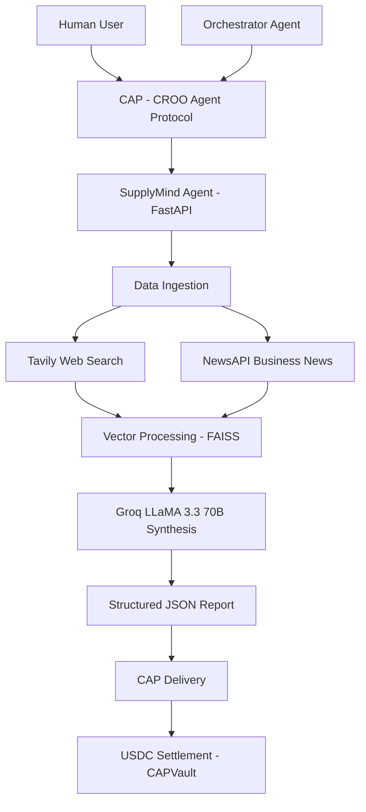
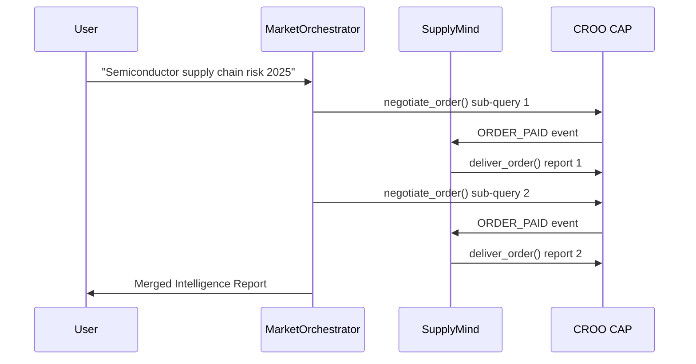

# SupplyMind — Real-Time Supply Chain Intelligence Agent on CROO

[](https://sekumohamed-supplymind.hf.space)
[](https://agent.croo.network)
[](LICENSE)
[](https://python.org)
[](https://fastapi.tiangolo.com)
[](tests/)

> The first AI-powered supply chain intelligence agent on CROO Agent Protocol (CAP). Submit a natural language query — get real-time risk scores, disruption signals, tariff exposure analysis, and alternative supplier recommendations. Every call is a paid on-chain transaction in USDC.

---

## The Problem

Supply chain managers today lose millions to blind spots:
- **Tariff volatility** — US-China tariffs hit 145% in 2025, changing weekly
- **Geopolitical disruptions** — Taiwan semiconductor risk, Red Sea shipping crisis
- **Analyst bottleneck** — senior planners cost $80K+/year and can only handle a few queries/day
- **No real-time intelligence** — existing tools (Kinaxis, Blue Yonder) cost $100K–$500K/year

**SupplyMind delivers per-query intelligence at $2 USDC** — 1000x cheaper than hiring an analyst.

---

## Market Opportunity

| Metric | Value |
|--------|-------|
| Agentic AI in supply chain (2025) | $8.67B |
| Market size (2030 projected) | $16.84B |
| CAGR | 14.2% |
| Companies investing in agentic AI by 2026 | 75% (Deloitte) |
| Revenue uplift from AI-driven supply chain | 61% greater (IBM) |

---

## Live Deployment

| Resource | URL |
|----------|-----|
| Production API | https://sekumohamed-supplymind.hf.space |
| Health Check | https://sekumohamed-supplymind.hf.space/health |
| API Documentation | https://sekumohamed-supplymind.hf.space/docs |
| CROO Agent Store | https://agent.croo.network |
| GitHub Repository | https://github.com/sekumohamed/Supplymind |

---

## Verified Live on CROO

This isn't just an integration that compiles — it has completed a **real, end-to-end transaction** on the CROO network: a buyer submitted a query through CROO Navigator, escrow locked real USDC, SupplyMind's agent accepted the negotiation, the payment was confirmed, the full intelligence pipeline ran, and the report was delivered with an on-chain settlement receipt.

```
NEGOTIATION CREATED  → new order request received from CROO network
NEGOTIATION ACCEPTED → order created
ORDER PAID           → payment confirmed, escrow released
ORDER PROCESSING     → intelligence pipeline running (fetch → embed → synthesize)
ORDER DELIVERED      → tx_hash: 0xedeecaa78fd5a2a1cbe7a3afeb061c305dd2019c958935ebaf970bab2353ae0b
```

In the course of getting here, three attribute-name mismatches between `croo-sdk` (v0.2.1, latest available) and the integration code were identified and fixed:

- WebSocket event objects expose fields directly (`event.negotiation_id`, `event.order_id`), not under a `.data` wrapper
- A buyer's requirements (query/depth input) live on the **Negotiation** object, not the **Order** object
- `accept_negotiation()` returns a nested `result.order.order_id`, not a flat `result.order_id`

All three are fixed in `app/cap/provider.py` and covered by the transaction above.

---

## CROO CAP Integration

### Services Listed on CROO Agent Store

| Service Name | Price | SLA | Deliverable |
|-------------|-------|-----|-------------|
| Supply Chain Analysis | 2 USDC | 5 min | JSON Report |

The service's Requirements schema is registered on CROO so buyers get a real input form (query + optional depth) rather than a blank checkout — this is what CROO Navigator renders when a buyer places an order.

### SDK Methods Used

```python
from croo import AgentClient, Config, EventType, DeliverOrderRequest, DeliverableType

# Provider side (SupplyMind)
client = AgentClient(config, sdk_key)
stream = await client.connect_websocket()
stream.on(EventType.NEGOTIATION_CREATED, on_negotiation)
stream.on(EventType.ORDER_PAID, on_order_paid)
await client.accept_negotiation(negotiation_id)
await client.deliver_order(order_id, DeliverOrderRequest(
    deliverable_type=DeliverableType.TEXT,
    deliverable_text=json_report
))
```

### Payment Flow
Caller → negotiate_order() → CAP
CAP → NEGOTIATION_CREATED → SupplyMind
SupplyMind → accept_negotiation() → CAP
Caller → pay_order() → CAPVault [USDC locked in escrow]
CAP → ORDER_PAID → SupplyMind
SupplyMind → run_pipeline() → deliver_order()
CAPVault → release USDC → SupplyMind wallet

---

## Reliability & Production Hardening

Built and tested beyond the happy path:

- **31/31 automated tests passing** — pipeline logic (hash determinism, no-documents fallback, metadata wiring), the API surface (validation, cache-hit behavior, history filtering), and the rate limiter (per-IP tracking, window expiry, internal bypass) all have real coverage, not just manual spot-checks.
- **Graceful degradation.** Tavily and NewsAPI calls are individually wrapped with timeouts and retry-with-backoff. If one source fails, the other can still populate the report. A `data_availability` field (`full` / `partial` / `unavailable`) tells the caller how much source material actually backed the analysis, rather than silently returning a thin report as if it were complete.
- **Rate limiting.** Public `/analyze` calls are capped per client IP (correctly resolving `X-Forwarded-For` behind a reverse proxy), protecting real Groq/Tavily spend from abuse. A separate internal bypass key exists for trusted callers and CI — never shipped to the public dashboard.
- **Structured logging with request IDs.** Every request gets a UUID propagated via `contextvars` through the whole call stack (fetch → embed → synthesize → cache → history), attached to every log line, and returned to the caller as an `X-Request-ID` response header — so any reported issue can be traced end-to-end.
- **Timezone-correct caching.** Cache expiry is computed and compared using timezone-aware UTC datetimes throughout, with defensive normalization on read to handle SQLite's lack of native timezone storage — this was a real bug caught by the test suite before it hit production.

Run the suite:
```bash
python -m pytest tests/ -v
```

---

##  System Architecture



## 🔄 A2A Composability



## API Reference

### POST /analyze

**Request:**
```json
{
  "query": "semiconductor supply chain risk Taiwan 2025",
  "depth": "standard"
}
```

**Parameters:**
| Field | Type | Required | Description |
|-------|------|----------|-------------|
| query | string | Yes | Natural language supply chain query |
| depth | string | No | "standard" (5 sources) or "deep" (10 sources) |

**Response** *(actual schema, as delivered in production)*:
```json
{
  "risk_level": "HIGH",
  "risk_score": 0.78,
  "risk_categories": {
    "geopolitical": {"score": 0.9, "rationale": "Export controls"},
    "financial": {"score": 0.2, "rationale": "No evidence found"},
    "climate": {"score": 0.0, "rationale": "No evidence found"},
    "cyber": {"score": 0.0, "rationale": "No evidence found"},
    "compliance": {"score": 0.8, "rationale": "Regulatory changes"}
  },
  "executive_summary": "Taiwan's semiconductor industry faces significant geopolitical risks due to its strategic position in global supply chains...",
  "disruption_signals": [
    {
      "source": "Reuters",
      "signal": "Rising US-China tensions affecting Taiwan Strait",
      "severity": "high"
    }
  ],
  "tariff_exposure": {
    "current_rate": "Unknown",
    "risk_scenario": "Potential increase in tariffs due to export controls",
    "estimated_annual_impact_usd": 1000000000
  },
  "alternative_suppliers": [
    {
      "name": "Samsung Foundry",
      "country": "South Korea",
      "fit_score": 0.81,
      "lead_time_weeks": 20
    }
  ],
  "action_items": [
    "Monitor regulatory updates",
    "Diversify supply chain",
    "Assess potential tariff impacts"
  ],
  "confidence_score": 0.7,
  "data_sources": ["Tavily", "NewsAPI"],
  "data_availability": "full",
  "processing_time_ms": 27485,
  "query_hash": "45b4ec92ac421e249d6efed8c5a23578"
}
```

Note: `risk_score` and every category's `score` are on a **0.0–1.0** scale. `data_availability` reflects how many documents actually backed the analysis (`full` ≥ 3 sources, `partial` < 3, `unavailable` = 0).

### GET /health
```json
{"status": "ok", "agent": "SupplyMind", "version": "1.0.0"}
```

### GET /history
`?query=...&limit=20` → array of past analyses (id, query, depth, risk_level, risk_score, executive_summary, created_at)

### GET /cap/activity
`?limit=15` → recent CAP negotiation/order lifecycle events, powers the live Activity panel on the dashboard

---

## Tech Stack

| Layer | Technology |
|-------|-----------|
| Language | Python 3.11 |
| Web Framework | FastAPI + uvicorn |
| CROO Integration | croo-sdk 0.2.1 |
| LLM Provider | Groq (LLaMA 3.3 70B) |
| Web Search | Tavily (advanced search + raw content) |
| News | NewsAPI (business news) |
| Vector Search | sentence-transformers + FAISS |
| Database | SQLite + SQLAlchemy (async) |
| Testing | pytest + pytest-asyncio |
| Deployment | HuggingFace Spaces (Docker) |
| CI/CD | GitHub Actions |

---

## Project Structure

```
supplymind/
├── app/
│   ├── api/
│   ├── cap/
│   │   ├── activity_log.py       
│   │   └── provider.py           
│   ├── intelligence/
│   │   ├── data_ingestion.py    
│   │   ├── embedder.py          
│   │   ├── synthesizer.py        
│   │   └── pipeline.py         
│   ├── models/
│   │   ├── cache.py
│   │   ├── history.py
│   │   └── order.py
│   ├── static/
│   │   └── index.html            
│   ├── utils/
│   │   ├── logging_config.py     
│   │   └── rate_limit.py         
│   ├── config.py
│   ├── database.py
│   └── main.py
├── examples/
├── orchestrator/
│   └── orchestrator.py
├── tests/
│   ├── conftest.py                
│   ├── integration/
│   │   └── test_api.py
│   └── unit/
│       ├── test_pipeline.py
│       └── test_rate_limit.py
├── pytest.ini
├── Dockerfile
├── requirements.txt
├── runtime.txt
├── .env
├── .gitignore
└── README.md
```
---

## Local Setup (10 minutes)

### Prerequisites
- Python 3.11+
- Git

### Installation

```bash
# Clone the repository
git clone https://github.com/sekumohamed/Supplymind
cd Supplymind

# Create virtual environment
python3 -m venv .venv
source .venv/bin/activate

# Install dependencies
pip install -r requirements.txt

# Start the server
uvicorn app.main:app --reload --port 8000
```

**Note:** don't run this locally at the same time as the deployed HuggingFace instance if they share the same `CROO_SDK_KEY` — CROO's WebSocket server enforces one active connection per key and will disconnect whichever connects second as a policy violation.

### Test the pipeline

```bash
# Test the intelligence engine
python -c "
import asyncio
from app.intelligence.pipeline import run_pipeline

async def test():
    report = await run_pipeline('semiconductor supply chain risk Taiwan 2025')
    print('Risk Level:', report.get('risk_level'))
    print('Summary:', report.get('executive_summary', '')[:150])

asyncio.run(test())
"
```

### Run the test suite

```bash
python -m pytest tests/ -v
```

### Run the A2A Orchestrator

```bash
# Terminal 1: Start SupplyMind
uvicorn app.main:app --reload --port 8000

# Terminal 2: Run Orchestrator
python -m orchestrator.orchestrator --query "AI chip market risk 2025"
```

---

## Environment Variables

| Variable | Description | Required |
|----------|-------------|----------|
| CROO_SDK_KEY | CROO Agent SDK key | Yes |
| CROO_API_URL | CROO API endpoint | Yes |
| CROO_WS_URL | CROO WebSocket URL | Yes |
| GROQ_API_KEY | Groq LLM API key | Yes |
| TAVILY_API_KEY | Tavily search API key | Yes |
| NEWS_API_KEY | NewsAPI key | Yes |
| DATABASE_URL | SQLite connection string | Yes |
| INTERNAL_API_KEY | Bypass token for rate limiting (internal/CI use only) | No |
| ENVIRONMENT | development/production | No |

---

## Roadmap

Not yet built, noted honestly rather than overclaimed:

- Scenario simulation ("what if X disruption happened" counterfactual mode)
- Supplier network graph (multi-tier visibility)
- Continuous background monitoring instead of only on-demand queries
- Source credibility weighting in the synthesis step
- Per-customer API key auth and usage metering for a full commercial tier

---

## License

MIT License — see [LICENSE](LICENSE) for details.